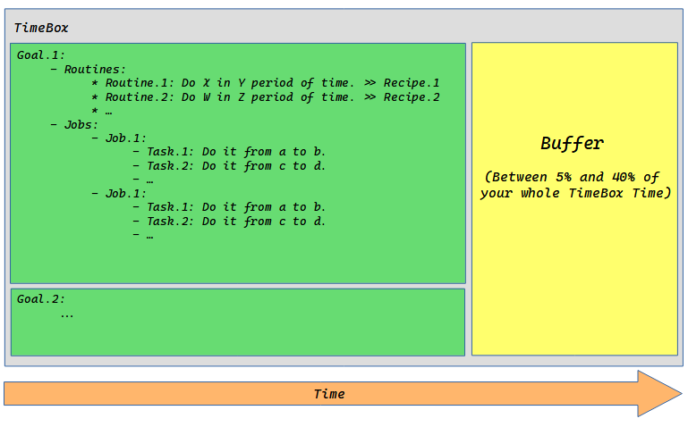

# Memento

A personal approach to controlling rogue time.

## Qoute
> “Memory’s not perfect. It’s not even that good. Ask the police. Eyewitness testimony is unreliable. The cops don’t catch a killer by sitting around remembering stuff. They collect facts, they make notes and they draw conclusions. Facts, not memory.”

Leonard Shelby

## Definitions
- Time can divide into three era: _past_, _present_ and _future_.
- But era is more rebel that we can imagine. So we should trap it in more short-period boundaries. I call those boundaries: **TimeBoxes**
- From this point you just see timeboxes. There are no opaque words like past, present and future.
- Every timebox has _only one_ **StartPoint** and _only one_ **EndPoint**.
- In any timebox, you define _at least_ one **Goal**.
- Goals can consist of: **Routines** or **Jobs** or both of them.
  - A Job consist of at least one **Task**.
- Jobs, tasks, routines also have a time boundary.(startpoint and endpoint.)
- Every timebox has _at least_ one **Outcome**.
- Every job/routine has _only_ one outcome.
- Outcome is a number between 0% - 100%.
- Routines/jobs/tasks should have **Priorities**.
- The steps that you follow to do a specific routine or job are called: **Recipe**.
  - Recipes can be shared by people.
- In every moment, you should be in a timebox.
- TimeBoxes don't overlap with each other.
- Timebox duration is up to you. It can be one hour, one day, one week, two weeks, one month, one year, etc..
- You can **Chain** timeboxes as long as you have goals for every timebox.
- Past are just collection of timeboxes that their lifetime were finished. (Look at it as a treasure or a way to be more productive in the Present/Future era.)
- **Experiences** are the outcome of timeboxes that their endpoints are less than current time.
- **Plans** are timeboxes that their startpoint are greater than current time.
  - If you can’t define at least one timebox, don't plan!
- But time is not always manageable.
- You can get sick. There may be an earthquake in your city. Or any other accidents that are beyond your control. How deal with them?
- We call these unpredictable accidents: **Events**.
- So you should have **Buffers** in your timeboxes to deal with events.
- You should define goals for your buffers. If no event occurred, follow them.
- Assign a portion of every timebox for buffers.(something between 5% and 20% is reasonable)

## How use this approach?

The simplest way is to write your own recipes/timeboxes on a paper and start following them :)
To help you get the idea, i included a simple recipe in this repo.

But the better way is to transform this approach to a software. So if you're a programmer, you're free to implement this specification
in any kind of software form that you like. (A library, an android app, a desktop app, etc..)

## Keywords
- TimeBox
- Goal
- Routine
- Job
- Task
- Outcome
- Priorities
- Recipe
- Experiences
- Plans

## Contribution
- If you have any idea to improve this approach, please let me know :)
- Also you can share your recipes with other people. Just create a PR for each recipe.

## Diagram

