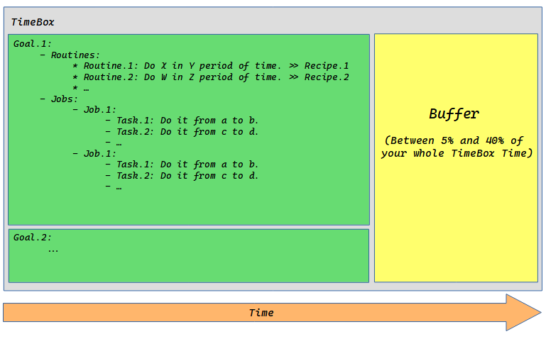

# Memento

A personal approach to controlling rogue time.

## Qoute
>> “Memory’s not perfect. It’s not even that good. Ask the police. Eyewitness testimony is unreliable. The cops don’t catch a killer by sitting around remembering stuff. They collect facts, they make notes and they draw conclusions. Facts, not memory.”
    Leonard Shelby

<h1 align="center">
    
     
    <h4 align="center">Creating a bootable USB with kindd. <a href="https://github.com/LinArcX/kindd/issues/10">[more]</a></h4>
</h1>

## Definitions
- Time can divide into three era: _past_, _present_ and _future_.
- But era is more rebel that we can imagine. So we should trap it in more short-period boundries. I call those boundries: **TimeBoxes**
- In every timebox, you define at least one **Goal**.
- Goals Can be either: **Routines** or **Jobs** or both of them.
  - A Job consist of at least one **Task**.
- Jobs, tasks, routines have a time boundary.(start and end point.)
- Every timebox has at least one **Outcome**.
- Every job/routine has only one outcome.
- Outcome is a number between 0% - 100%.
- Routines/jobs/tasks should have **Priorities**.
- The steps that you follow to do a specific routine or job are called: **Recipe**.
  - Recipes can be shared by people.
- For the present era, you have only one timebox.
  - Present timebox duration is up to you. It can be one day, one week, two weeks, one month, etc..
- Past is past. Look at it as a treasure or a way to be more productive in the Present/Future era.
- **Experiences** are the outcome of timeboxes in the past era.
- **Plans** are timeboxes defined for the future era.
- Future is a trap. Define Plans only for a specific period of time in the future.
- For the future era, you’re free to define your timeboxes as longs as you define goals for them.
- If you can’t define at least one timebox, don't plan!
- Sometimes you can’t predict a specific **Event** in your life.
- So you should have **Buffers** in your timeboxes.
- You can define goals for your buffers. If no event occurred, follow them.
- Assign a portion of every timebox for buffers.(something between 5% and 45%)

# Keywords
- Era
- TimeBox
- Goal
- Routine
- Job
- Task
- Outcome
- Priorities
- Recipe
- Experiences
- Plans

# Diagram

